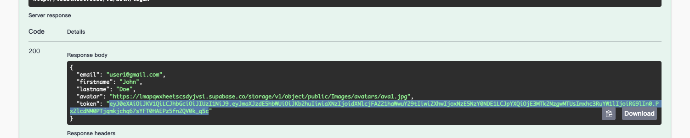
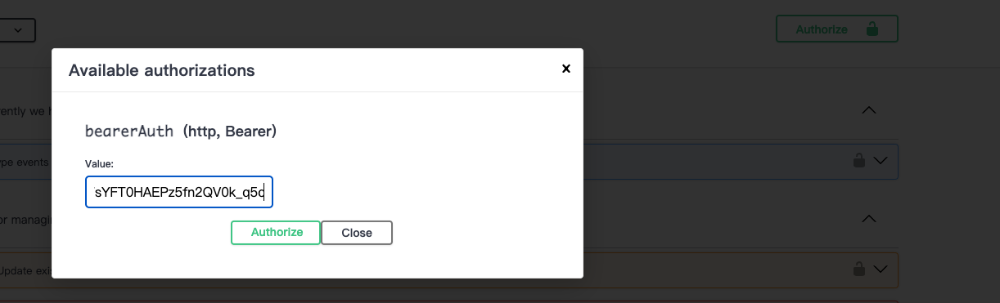

## Comment tester le backend avec l'authentification JWT à l'aide de Swagger

1. Utilisez le endpoint *register* pour enregistrer un compte. Bien sûr, vous pouvez également utiliser ce compte (e-mail : user1@gmail.com, password : 12345678).

2. Utilisez le endpoint *login* en saisissant l'email et le mot de passe.

3. Ensuite, vous obtiendrez un jeton, comme le montre la figure ci-dessous :    

4. Copiez ce jeton et cliquez sur le bouton *Authorize* en haut à droite. La fenêtre suivante apparaîtra. Veuillez coller votre jeton et cliquez sur "Authorize". 
## Database information

### Event Management 1

| Attrributs           | Values                                                   |
|----------------|----------------------------------------------------------|
| **Name**       | event management 1                                       |
| **Host**       | flora.db.elephantsql.com                                 |
| **Port**       | 5432                                                     |
| **User**       | zymejaql                                                 |
| **Password**   | eEeLOMC7PylAvmGhR7rtna9AQAAsbVMj                         |
| **Database**   | zymejaql                                                 |
| **URL**        | jdbc:postgresql://flora.db.elephantsql.com:5432/zymejaql?stringtype=unspecified |

### Event Management 2

| Attrributs           | Values                                                                                 |
|----------------|----------------------------------------------------------------------------------------|
Name      | event management 2                                                                     |
Host       | lucky.db.elephantsql.com                                                               |
Port       | 5432                                                                                   |
User       | nizybsdl                                                                               |
Password   | 01N0MXhVJXeTZjtRaEWj0yOaDSZ2ZLWg                                                       |
Database   | nizybsdl                                                                               |
URL        | jdbc:postgresql://lucky.db.elephantsql.com:5432/nizybsdl?stringtype=unspecified |
